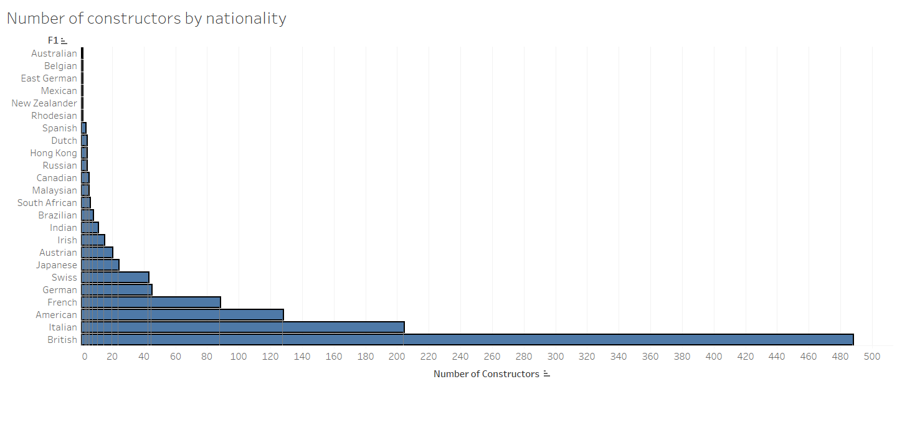

# Formula 1 Constructor Analysis

## Overview
This project examines the performance of Formula 1 constructors, analysing their success rates by nationality. Through SQL queries and data insights, we explore the historical and modern dominance of certain nationalities and teams within the sport.

## Data Overview
The analysis uses data from the `F1_Analysis` database, focusing on two key tables:
- **constructors**: Provides details about constructor names and their nationalities.
- **results**: Records race results, including constructors’ positions in each race.

## SQL Queries and Insights

### 1. Constructor Distribution by Nationality
**Purpose**: This query calculates the percentage of constructors by nationality and orders them by total count. It identifies the representation of each nationality among constructors in Formula 1.

```sql
SELECT c.Nationality, 
       COUNT(c.Nationality) AS TotalConstructors, 
       CAST(COUNT(c.Nationality) * 100.0 / SUM(COUNT(c.Nationality)) OVER () AS DECIMAL(5, 2)) AS Percentage
FROM F1_Analysis.dbo.constructors c
GROUP BY c.Nationality
ORDER BY TotalConstructors DESC;
```

### Insights:
British constructors are the most represented, followed by Italian and American constructors.
A comparison with historical data highlights the evolution of constructor distribution over time.

## 2. Modern Constructor Distribution (Post-2000)
Purpose: This query calculates the percentage of constructors by nationality and orders them by total count, focusing on the modern era (post-2000). The results allow for a comparison with historical trends to observe changes in constructor distribution.

```sql
SELECT c.Nationality, 
       COUNT(c.Nationality) AS TotalConstructors, 
       CAST(COUNT(c.Nationality) * 100.0 / SUM(COUNT(c.Nationality)) OVER () AS DECIMAL(5, 2)) AS Percentage
FROM F1_Analysis.dbo.constructors c
WHERE c.Year >= 2000
GROUP BY c.Nationality
ORDER BY TotalConstructors DESC;
```

### Insight:

The dominance of British and Italian constructors persists in the modern era, but new nationalities have entered the competition, contributing to a more diverse landscape.

## 3. Wins by Constructor Nationality
Purpose: This query calculates the number of wins by constructors grouped by nationality. It helps assess how effective each nationality is at winning and whether there is a correlation between the number of constructors and their success rates.

```sql
SELECT c.Nationality, 
       COUNT(CASE WHEN r.Position = 1 THEN 1 END) AS TotalWins, 
       COUNT(DISTINCT c.Name) AS TotalConstructors
FROM F1_Analysis.dbo.results r
INNER JOIN F1_Analysis.dbo.constructors c ON r.ConstructorName = c.Name
GROUP BY c.Nationality
ORDER BY TotalWins DESC;
```

### Insight:

Italians lead in total wins, with Ferrari contributing the vast majority.
The data suggests that quality, rather than the number of constructors, is a key determinant of success.

## 4. Breakdown of Italian Constructors’ Wins
Purpose: This query breaks down the Italian constructors, showing how many races each has won. It highlights whether Ferrari’s dominance accounts for most of Italy’s success or if other teams also contribute significantly.

```sql
Copy code
SELECT c.Name AS Constructor, 
       c.Nationality, 
       COUNT(CASE WHEN r.Position = 1 THEN 1 END) AS TotalWins
FROM F1_Analysis.dbo.results r
INNER JOIN F1_Analysis.dbo.constructors c ON r.ConstructorName = c.Name
WHERE c.Nationality = 'Italian' AND r.Position = 1
GROUP BY c.Name, c.Nationality
ORDER BY TotalWins DESC;
```

### Insight:

Ferrari accounts for 9,000 of Italy’s 9,018 wins, representing 99.8% of the total.
Toro Rosso and AlphaTauri have contributed marginally, with 14 and 4 wins respectively.

## Visualisations
### Constructor Distribution by Nationality


### Wins by Constructor Nationality


### Breakdown of Italian Constructors


## Conclusion
The analysis demonstrates that while British constructors are the most represented, Italian constructors dominate in total wins, driven almost entirely by Ferrari. The data also highlights a trend of quality over quantity, as fewer constructors can achieve greater success. In the modern era, while Italian dominance persists, the sport has seen increased competition from a broader range of nationalities.
